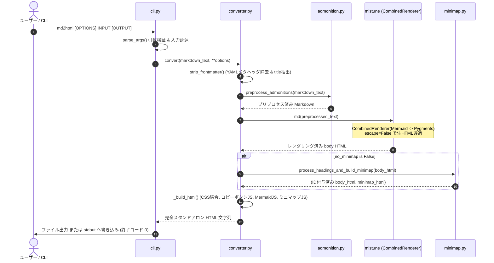

# md2html 機能設計書 (Functional Design Specification)

## 1. システムアーキテクチャ & モジュール構成

### 1.1 モジュール構成一覧

本ツールは、単一 HTML 生成パイプラインを中心に、以下のモジュール群で構成されています。

| モジュール / ディレクトリ | 役割・責務 |
| :--- | :--- |
| [`src/md2html/cli.py`](file:///home/ynaka/gitlab/md2html/src/md2html/cli.py) | コマンドライン引数解析 (`argparse`)、ファイル / 標準入出力制御、終了ステータス管理 |
| [`src/md2html/builder.py`](file:///home/ynaka/gitlab/md2html/src/md2html/builder.py) | 複数ファイルクローラー & フォルダサイト構築 (リンク追従、`.md`→`.html` 書き換え、非Markdownアセット複製) |
| [`src/md2html/converter.py`](file:///home/ynaka/gitlab/md2html/src/md2html/converter.py) | 変換パイプライン全体のオーケストレーション、Front Matter 抽出、MRO レンダラー合成、CSS/JS 結合、HTML 組み立て |
| [`src/md2html/admonition.py`](file:///home/ynaka/gitlab/md2html/src/md2html/admonition.py) | MkDocs 形式 (`!!!`) および Docusaurus 形式 (`:::`) の注意書きブロック正規表現プリプロセッサ |
| [`src/md2html/highlighter.py`](file:///home/ynaka/gitlab/md2html/src/md2html/highlighter.py) | Pygments 連携 `mistune.HTMLRenderer` サブクラスによるコードブロックハイライト |
| [`src/md2html/mermaid.py`](file:///home/ynaka/gitlab/md2html/src/md2html/mermaid.py) | Mermaid 連携 `mistune.HTMLRenderer` サブクラスおよびインライン実行スクリプト生成 |
| [`src/md2html/minimap.py`](file:///home/ynaka/gitlab/md2html/src/md2html/minimap.py) | 見出し (h1〜h6) 抽出、アンカー ID 自動付与、目次サイドバー (TOC) HTML およびスクロール連動スクリプト生成 |
| [`src/md2html/assets/`](file:///home/ynaka/gitlab/md2html/src/md2html/assets/) | インライン埋め込み用 CSS（GitHub, GitLab, Admonition, コピーボタン, ミニマップ） |

### 1.2 変換パイプラインのシーケンス



---

## 2. CLI 制御モジュール (`md2html.cli`)

### 2.1 概要・責務
コマンドラインからの呼び出しを受け付け、引数を検証し、入力テキストの取得から変換処理、出力先への書き込み、例外時のエラーハンドリングと終了コード管理を担当します。

### 2.2 関数仕様

#### `parse_args(argv: list[str] | None = None) -> argparse.Namespace`
- **引数**:
  - `argv`: コマンドライン引数リスト（省略時は `sys.argv[1:]` をパース）。
- **戻り値**:
  - パース結果の `argparse.Namespace` オブジェクト。
- **オプション定義**:
  - `input` (位置引数, 必須): Markdown ファイルパス、または `-`（標準入力）。
  - `output` (位置引数, 任意): 出力先 HTML ファイルパス（省略時は `None`）。
  - `--title` (任意): `<title>` タグの文字列。省略時はファイル名（拡張子除く）または stdin。
  - `--theme` (任意): `github` (デフォルト), `gitlab`, `auto`。
  - `--highlight-style` (任意): Pygments カラースキーム名（デフォルト: `default`）。
  - `--no-highlight` (フラグ): シンタックスハイライト無効化。
  - `--mode` (任意): `auto` (デフォルト), `light`, `dark`。
  - `--no-mermaid` (フラグ): Mermaid レンダリング無効化。
  - `--no-minimap` / `--no-toc` / `--disable-minimap` (フラグ): ミニマップサイドバー非表示。

#### `main() -> None`
- **処理フロー**:
  1. `parse_args()` を呼び出して引数を取得。
  2. `args.input == "-"` の場合:
     - `sys.stdin.read()` で標準入力から読み込み。
     - `converter.convert(...)` により単一 HTML を生成。
     - `args.output` が指定されていれば `output/index.html` に書き込み、未指定なら `sys.stdout.write(html)` で標準出力。
  3. ファイル指定（通常実行）の場合:
     - `output_dir = args.output or "dist"` を決定。
     - `builder.build_site(...)` を呼び出し、起点 Markdown の変換、リンク先 Markdown の連鎖的変換、およびアセットファイルのコピーを実行。
  4. 例外発生時（`FileNotFoundError`, 変換例外等）は `sys.stderr.write(f"Error: {e}\n")` を出力し、`sys.exit(1)` で異常終了。

---

## 3. サイトビルダー & リンククローラーモジュール (`md2html.builder`)

### 3.1 概要・責務
起点となる Markdown ファイルから開始し、相対リンクされている他の Markdown ファイルを再帰的に探索して HTML へ一括変換します。同時に、HTML 内の `.md` への相対リンクを `.html` へ書き換え、参照されている画像や添付ファイルを出力フォルダへ相対パス構造を維持してコピーします。

### 3.2 関数仕様

#### `build_site(entry_md_path: str, output_dir: str, ...) -> dict[str, list[str]]`
- **処理フロー**:
  1. **到達可能ファイル探索（第1パス）**: 起点 Markdown から開始し、BFS で到達可能な全 Markdown ファイル（`.md`, `.markdown`）の絶対パスを探索・収集。
  2. **共通ルートディレクトリ決定**: 起点ディレクトリ、または全対象 Markdown ファイルの共通親ディレクトリ（`common_root`）を算出。
  3. **変換 & リンク書き換え & アセットコピー（第2パス）**:
     - 各 Markdown を `converter.convert(...)` で HTML レンダリング。
     - `_rewrite_links_and_collect` により HTML 内の `<a>` タグの `.md` リンクを `.html` に書き換え。
     - `<a>` および ``, `<source>`, `<video>`, `<audio>` から相対パス指定された非 Markdown 実ファイルを検出し、出力先フォルダ内の相対位置へ `shutil.copy2` で複製。
     - 変換済み HTML を出力フォルダ内の対応するサブディレクトリパスへ保存。
- **戻り値**:
  - `{"html": [生成されたHTML絶対パス一覧], "assets": [コピーされたアセット絶対パス一覧]}`

#### `_rewrite_links_and_collect(html: str, current_md_path: str, html_out_path: str) -> tuple[str, list[str], list[tuple[str, str]]]`
- `BeautifulSoup` により DOM を走査。
- 相対リンクかつ実ファイルが存在する場合、拡張子に応じて `.html` への URL 書換、またはアセットコピー対象として抽出。

---

## 4. 変換オーケストレーションモジュール (`md2html.converter`)

### 3.1 概要・責務
Front Matter の処理、Admonition の前処理、Mistune レンダラーの動的合成、カラーモードに応じた CSS フィルタリング、インライン JavaScript のアセンブルを行い、完全スタンドアロンな単一 HTML を構築します。

### 3.2 関数・クラス仕様

#### `strip_frontmatter(text: str) -> tuple[str, str | None]`
- **正規表現**: `^\s*---\r?\n(?P<yaml>[\s\S]*?)\r?\n---\r?\n?`
- **処理内容**:
  - 文頭の Front Matter（YAML ブロック）を検出し、本文から除外した文字列を返却。
  - `yaml` ブロック内から `^\s*title:\s*["']?(?P<title>[^"'\n]+)["']?\s*$` により `title` 属性値を抽出（存在しない場合は `None`）。

#### レンダラー動的合成 (`_make_renderer`)
- **MRO 設計**:
  ```python
  if not no_mermaid and not no_highlight:
      class CombinedRenderer(MermaidRenderer, HighlightRenderer):
          pass
      renderer = CombinedRenderer(escape=False, highlight_style=highlight_style)
  elif not no_mermaid:
      renderer = MermaidRenderer(escape=False)
  elif not no_highlight:
      renderer = HighlightRenderer(escape=False, highlight_style=highlight_style)
  else:
      renderer = mistune.HTMLRenderer(escape=False)
  ```
- **重要規約**: 必ず `escape=False` を全クラスに指定すること。

#### カラーモード CSS 制御
- `_DARK_MEDIA_RE`: `@media\s*\(prefers-color-scheme:\s*dark\)\s*\{((?:[^{}]|\{[^{}]*\})*)\}`
- `_strip_dark_media(css: str) -> str`: ダーク用メディアクエリブロックを正規表現置換で完全除去。
- `_unwrap_dark_media(css: str) -> str`: メディアクエリのラッパーを除去し、内包されたルールを無条件適用に変換。
- `_apply_mode(css: str, mode: str) -> str`:
  - `mode == "light"`: `_strip_dark_media(css)`
  - `mode == "dark"`: `_unwrap_dark_media(css)`
  - `mode == "auto"`: CSS をそのまま維持。

#### `_build_css(theme: str, highlight_style: str, no_highlight: bool, mode: str = "auto") -> str`
- 各アセット CSS（`github.css` / `gitlab.css`, `admonition.css`, `copy-button.css`, `minimap.css`）に `_apply_mode` を適用して連結。
- Pygments の `HtmlFormatter` からライト用スタイルおよびダーク用（`github-dark`）スタイルを取得し、モードに応じて `<style>` 内に結合。

#### `_copy_button_script_tag() -> str`
- クリップボードコピーボタン制御用 JavaScript を即時実行関数（IIFE）としてインライン `<script>` 化。
- 対象セレクタ: `div.highlight` および `.markdown-body pre:not(.mermaid)`。
- コピー成功時に `✓ Copied` 表示へ切り替え、2秒後に元の `Copy` に復帰。

#### `convert(...) -> str`
- パイプラインを直列実行し、完全な HTML ドキュメント文字列を生成して返却。

---

## 5. Admonitions プリプロセスモジュール (`md2html.admonition`)

### 4.1 概要・責務
Mistune によるパース前に、MkDocs 形式 (`!!!`) および Docusaurus 形式 (`:::`) の注意書きブロックを正規表現・インデント解析によって `<div class="admonition <type>">` の HTML 構造へ変換します。

### 4.2 サポートタイプ定数
- `MKDOCS_TYPES`: `{"note", "info", "tip", "success", "warning", "danger", "failure", "bug", "example", "quote", "abstract"}`
- `DOCUSAURUS_TYPES`: `{"note", "tip", "info", "caution", "danger", "warning"}`

### 4.3 解析アルゴリズム

#### 1. Docusaurus 形式 (`_parse_docusaurus`)
- **開始行正規表現**: `^(?P<indent>[ \t]*):::(?P<type>\w+)(?:[ \t]+(?P<title>[^\n]+))?$`
- **終了条件**: 現在行の `strip()` が `:::` に完全一致すること。
- **インデント処理**: 開始行のベースインデント長分、本文各行の先頭インデントを除去。

#### 2. MkDocs 形式 (`_parse_mkdocs`)
- **開始行正規表現**: `^(?P<indent>[ \t]*)!!![ \t]+(?P<type>\w+)(?:[ \t]+"(?P<title>[^"]*)")?[ \t]*$`
- **終了条件**: 空行ではない行において、ベースインデント + 4 文字以上のインデント（またはタブ）が途切れた時点でブロック終了と判定。
- **ネスト・リスト内対応**: リスト項目内や引用ブロック内に置かれた場合でも、外側のベースインデントを保持して正しくパースを継続。

#### 3. 出力 HTML テンプレート (`_make_admonition_html`)
```html
<div class="admonition {type}">
<p class="admonition-title">{title}</p>

{body_lines}
</div>
```

---

## 6. シンタックスハイライトモジュール (`md2html.highlighter`)

### 6.1 概要・責務
フェンスコードブロック（` ```言語名 `）に対して Pygments を適用し、構文トークンごとにクラス名が付与された HTML 出力を生成します。

### 6.2 クラス仕様: `HighlightRenderer(mistune.HTMLRenderer)`

#### `block_code(self, code: str, **attrs) -> str`
1. `attrs.get("info")` から言語識別子 `lang` を抽出。
2. `lang` が空の場合は、HTML エスケープ（`&`, `<`, `>`）を施した `<pre><code>...</code></pre>\n` を返却。
3. `get_lexer_by_name(lang, stripall=True)` により Lexer を取得。
   - `ClassNotFound` 例外発生時: 未知言語としてプレーンコード形式で安全にフォールバック。
4. `HtmlFormatter(nowrap=True)` を使用してハイライトトークン HTML を取得。
5. `<div class="highlight"><pre><span></span>{highlighted}</pre></div>\n` としてラップして返却。

---

## 7. Mermaid ダイアグラムモジュール (`md2html.mermaid`)

### 7.1 概要・責務
言語が `mermaid` のコードブロックをブラウザ側レンダリング用の要素へ変換し、インライン実行スクリプトを提供します。

### 7.2 クラス仕様: `MermaidRenderer(mistune.HTMLRenderer)`

#### `block_code(self, code: str, **attrs) -> str`
- 言語が `mermaid` の場合:
  ```html
  <pre class="mermaid">
  {code}
  </pre>
  ```
  を返却。
- それ以外の言語の場合:
  - `super().block_code(code, **attrs)` を呼び出し、MRO 次順の `HighlightRenderer` へ委譲。

### 7.3 インラインスクリプト生成: `mermaid_script_tag(mode: str = "auto") -> str`
- **テーマ判定式**:
  - `mode == "light"`: `'default'`
  - `mode == "dark"`: `'dark'`
  - `mode == "auto"`: `window.matchMedia('(prefers-color-scheme: dark)').matches ? 'dark' : 'default'`
- **初期化**:
  `mermaid.initialize({startOnLoad: true, theme: <テーマ判定式>});`
- **バンドル読み込み**:
  `src/md2html/assets/mermaid.min.js` が存在する場合はその内容を展開。存在しない場合は CDN（`cdn.jsdelivr.net`）へのフォールバックスクリプトタグを生成。

---

## 8. ミニマップ (TOC) モジュール (`md2html.minimap`)

### 8.1 概要・責務
Mistune による HTML 出力から見出しタグ（`<h1>`〜`<h6>`）を走査し、アンカー ID の自動付与、右側固定目次サイドバーの HTML 構築、およびスクロール連動スクリプトの注入を行います。

### 8.2 スラッグ生成ロジック (`_slugify`)

1. 見出しタグ内の HTML マークアップを `_TAG_STRIP_RE` (`<[^>]+>`) で除去し、プレーンテキストを取得。
2. 空白文字（半角スペース、タブ、改行）をハイフン `-` に置換。
3. 日本語（`\u3000-\u30fe`, `\u4e00-\u9fa5`, `\uFF00-\uFFEF`）および英数字・アンダースコア・ハイフン以外の記号を除去。
4. 文字列が空になった場合は `"heading"` をフォールバック。
5. 当該文書内で既に使われている ID（`used_ids`）と重複する場合、末尾に `-1`, `-2` の連番サフィックスを付与して一意性を確保。

### 8.3 目次サイドバー HTML 構造 (`_generate_minimap_html`)

```html
<aside class="minimap-wrapper" aria-label="ミニマップ">
  <nav class="minimap">
    <ul class="minimap-list">
      <li class="minimap-item level-1"><a href="#id-1" title="見出し1">見出し1</a></li>
      <li class="minimap-item level-2"><a href="#id-2" title="見出し2">見出し2</a></li>
    </ul>
  </nav>
</aside>
```

### 8.4 スクロールスパイ スクリプト仕様 (`minimap_script_tag`)

- ブラウザの `IntersectionObserver` API を使用して、画面上部領域に交差した見出し要素を監視。
- 現在表示中のセクションに対応する `.minimap-item a` に `.active` クラスを付与し、太字・アクセントカラーで強調表示。
- ハッシュ変更時（`hashchange` イベントおよびクリック時）のスムーズスクロールとアクティブ表示の即時同期。

---

## 9. 静的アセット仕様 (`src/md2html/assets/`)

### 9.1 スタイルシート一覧

| ファイル名 | 主な定義内容 |
| :--- | :--- |
| `github.css` | GitHub 風 Markdown スタイル。CSS 変数（`--color-fg-default`, `--color-canvas-default` 等）、フォントスタック、テーブル罫線、引用枠、`@media (prefers-color-scheme: dark)` 定義 |
| `gitlab.css` | GitLab 風ドキュメントスタイル。GitLab 独自のカラーパレットおよびフォントサイズ・行間定義 |
| `admonition.css` | 各タイプ（note, tip, warning, danger 等）のボーダーカラー、背景カラー、アイコン（Unicode 絵文字）設定 |
| `copy-button.css` | コードブロック右上への絶対配置、ホバー時フェードイン、クリック時スタイル定義 |
| `minimap.css` | `position: sticky; top: 24px;` による固定追従レイアウト、階層別インデント (`.level-1`〜`.level-6`)、アクティブリンク強調スタイル |

### 9.2 レスポンシブ設計
- 画面幅 `1024px` 以上: `.app-container` が Flex / Grid 配置となり、本文（最大 980px）と右側ミニマップ（幅 240px〜280px）が並列表示。
- 画面幅 `1024px` 未満: メディアクエリによりミニマップを本文上部または折りたたみ表示へ切り替え、モバイル環境での閲覧性を確保。
