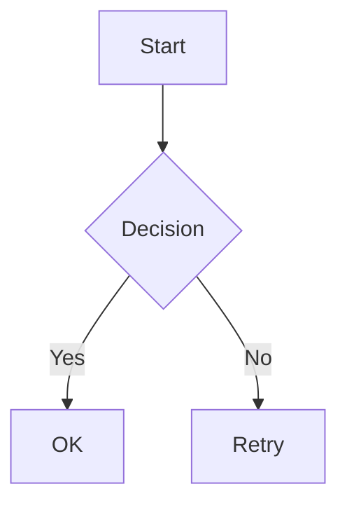
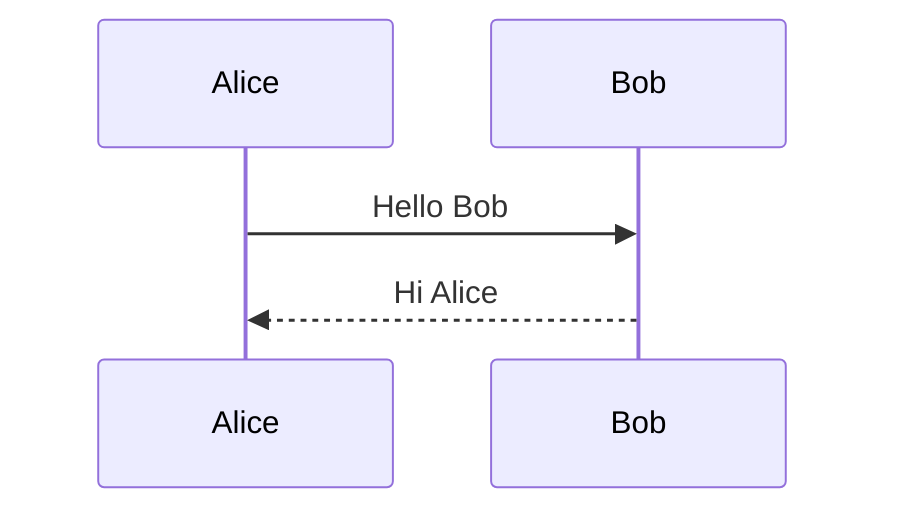
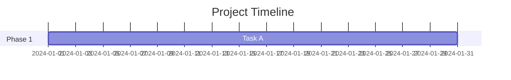

## Mermaid Diagrams

Flowchart:

```mermaid
flowchart TD
    A[Start] --> B{Decision}
    B -- Yes --> C[OK]
    B -- No --> D[Retry]
```

Sequence diagram:

```mermaid
sequenceDiagram
    Alice->>Bob: Hello Bob
    Bob-->>Alice: Hi Alice
```

Gantt chart:

```mermaid
gantt
    title Project Timeline
    dateFormat  YYYY-MM-DD
    section Phase 1
    Task A :a1, 2024-01-01, 30d
```
